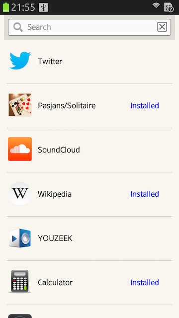

### Firefox Marketplace API が面白いので
### あんなものやこんなもの作ってみました

---
### 自己紹介

ひらとりはやと

### Twitter: [@flatbirdH](https://twitter.com/flatbirdH)

---
### 職業

プログラマ

#### Linux (C), Windows (C++), Android (Java), iOS (Objective-C)
#### ファイアウォールとかプロキシとか。
#### 組み込みっぽいのも少々。

---
## Firefox Marketplace がスゴい

---
## 何がすごい？
## 
公開っぷりがスゴい

---
### API が公開されてます
 
## Firefox Marketplace API

<http://firefox-marketplace-api.readthedocs.org/>

---
### 商業的な利用価値高い
### アプリマーケット情報

- 色々使える
 - 市場調査
 - ASO: App Search Optimization
 - セキュリティ (アプリのフィルタリング)

 
### 
Firefox Marketplace API は 気前よく公開

---
## "Search" API

<table class="api-query-container">
	<tbody>
		<tr>
			<td class="method">GET </td>
			<td class="path"><input id="api-query" value="/api/v1/apps/search/?q=twitter"></td>
		</tr>
	</tbody>
</table>
<pre class="api-output-container"><code id="api-output" class="javascript"></code></pre>

---
### 取得できるアプリ情報
- 名前 (name)
- アイコン (icons)
- 作成者 (author)
- 説明 (description)
- カテゴリ (categories) ... games, utilities, travel, etc.
- デバイス (device) ... desktop, firefoxos, android-mobile, android-tablet
- アプリ種別 (app_type) ... hosted, packaed, privileged
- マニフェスト URL (manifest_url)
- レーティング情報 (ratings)
- etc, etc.

---
## さらに・・・

---
## ZIP でくれ！
 
<pre class="maro">
　　　　　　　　　　 |;;;;;;;;;;;;;;;;;;;;;;;;;;;;;;;;;;;;;;;;;;;;;;;;;;;;;;;;;;;;;;;;;;;ノ| 
　　　　　　　　　　 |丶､ ;;; __;;;;;;;;;;;;;;;;;;;;;;;;;;;;;;;;;;;;;;_,,: ィ";;_| 
　　　　　　　　　　 ﾄ､;;;;;;;;;;;;;;;｀ ` '' ー -- ‐ '' ";;;;;;;;;,:ィ;:;! 
　　　　　　　　　　,';:｀`' ‐ｮ ､ ,_ ;;;;;;;;;;;;;;;;;;;;;;;;;;; , - '"l;:;:;:;:l 　　だまりゃ！そのほう麿をなんと心得る！
　　　　　　　　　　l;:;:;:;:;:;:;ﾐ　　 ｀ ` '' ｰ -‐ '"　　　 ,ﾘ;:;:;:l 
　　　　　　　　　　l;:;:;:;:;:;:;:ゝ　　 く三)　　　(三ｼ　　｀ヾ;:t、 　恐れ多くも帝より三位の位を賜わり 
　　　　　　　　　fﾐ{;:;:;:;:f'´　 , -－-_,, _,ｨ ､_,,ｨ,.-－､　 };f } 
　　　　　　　　　l ﾄl;:;:;:;:l　　､,ィ或tｭ､ﾞ:ミ　{,'ィt或ｱﾁ　l:l,/　　中納言まで勤めた麿の言うことを聞かなくば 
　　　　　　　　　ﾞi,tヾ:;:;:!　　｀ヽ 二ノ　　　ﾄ ` ‐''"´　 l:l:f 
　　　　　　　　　 ヽ`ｰ};:l　　　　　　 ,r'､ 　 ヽ 　 　　　ﾘ_）　　どのようなことになるのか分かっておるのか！ 
　　　　　　　　　　 ｀"^l:l　　　　　 ,/ﾞｰ､　 ,r'ヽ　　　　l 
　　　　　　　　　　　　　ﾞi　　　　,ノ　 　 `'"　 丶.　　 ,'　　　 麿は画像一枚が欲しいのではない！zipじゃ！
　　　　　　　　　 　 　 　ﾞl､　　 ′ ,, ｨrｪェzｭ､,_ 〉 } / 
　　　　　　　　　　　　　　',ヽ　　ヘヾ'zｪｪｪッ',ｼ'　//ヽ 　　　 zipを出さねば朝敵じゃ！
　　　　　　　　　　　　　　 }　丶、　` ｰ--‐ '"'´,/ノ:.:.:ヽ 
　　　　　　　　　　　　　　/l　　 丶、　　　 　 ,.ｲ:.:.:.:.:.:.:.:丶､、謀反人！逆賊！と呼ばれても申し開きできまいが！ 
　　　　　　　　　　　 ,r'"^l　!　　　　` ー‐;オ´:.:.:.:.:.:.:.:.:.,ノ　 ,}、 
　　　　　　　,. -ｧ＝く（:.:.:.l　 l　　　　　 ／/:.:.:.:.:.:., - '"　 ,／　ヽ、 
　　　 , - '"´ ／　,／｀＞'t､_」＿＿_,ｨ'ﾞ,ィ,.: -‐ '"　,. -‐ '"　　　　＼ 

</pre>

## 
zipじゃ！

## 
zipを出さねば朝敵じゃ！

---
### 日次ダンプデータを丸ごと落とせる
### "Export" API

<pre class="api-query-container export">https://marketplace.cdn.mozilla.net/dumped-apps/tarballs/YYYY-MM-DD.tgz</pre>

<h2>気前がいい！</h2>
<h2>まさにネ申</h2>

---
## これでなんかできそう！
## 
ということで、作りました。

---
## [www.firechart.info](http://www.firechart.info/)

- Firefox Marketplace の情報をグラフで表示。
- Export API の zip データを利用。

---
### 1. アプリ数の増加傾向

---
### 2. カテゴリー

---
### 3. ホスト型 / パッケージ型の比率

---
### 4. Default Locale
#### 必ずしも、サポート言語を表す訳ではないですが、、、

---
### ホスト型アプリとしても公開してます

### 時々止まってるのはご愛嬌

---
## Firefox Marketplace の
## さらにすごい公開っぷり

---
## ソースも公開！
- クライアント側アプリ
	- Fireplace
		- <https://github.com/mozilla/fireplace>
- サーバ側
	- Zamboni 
		- <https://github.com/mozilla/zamboni>
	- Marketplace API のソースもここにある。

---
## さらに
 
<pre class="maro">
        　　　　　　　　 ,l､::::::::::::::::::::::::::::::::::|:;:;:;:;:;:;:;:;:;:;:;:;:;:;:;:;:l 
        　　　　　　　　,ﾊ::｀丶､:::::::::::::::::::::::|:;:;:;:;:;:;:;:;:;:;_,, -‐:〈 
        　　　　　　　　{;;;;ヽ､:::::｀丶､:::::::::::::l:;:;:;:;:;:; ィ";:;:;:;:;:;:;:} 
        　　　　　　　　,l;;;;;;;;;ｼ丶､:::::::｀:`:ー'‐::'':"::::::::_, ィ"´;;l 
        　　　　　　　fうl;;;ミミ、　 ｀`丶 ､::::::::,: - ''"´　 ﾘ;;;;;;f-､ 
        　　　　　　　{ l l;;;;;ｯ=`　　 (三> ｀^´ (三ｼ　　ム;;;;;;ｿl} 
        　　　　　　　t　!;;;ﾘ　 　 _,,...,,_　　　　　_,,..,,_　 　 l;;;// 
        　　　　　　 　ﾞl ヾ;l 　:'ｨﾃﾍ9ﾝﾐ　　 ,: ',ｼﾋ9ﾝ､　　l;// 
        　　　　　　　　`ｰll!　　 ｀''==ヲ'　　l:.:^''==彡'"　,!ﾘﾉ 
        　　　　　 　 　 　 ll　　　` '' "　　　l:.:.:` '' "　　,i;;l´           
ZIP...

        　　　　　　　　　　li,　　　　　,r　.:　:.ヽ､　　　 ,:,り 
        　　　　　　　　　　 t、　　　/ ﾞｰ､　,r 'ﾞヽ　　/,K′ 
        　　　　　　　　　　　ゝ、　,:'　　　:~:　 　 }　// /ヽ、 
        　　　　　　　　　　　/{lヽ ,ィ＝=ﾆﾆ=＝,ﾉ,ノ7 /:.:.:.:ヾﾆヽ 
        　　　　　　　　 , ィ/:.:い ヽ ｀` ー一 ''"／,/,/:.:.:.:.:.:.:.:ｿ }- ､、 
        　　　　　　　 /　/:.:.:.:ヽヽ `' ー‐ -- '"／／:.:.:.:.:.:.:／ /　　 ｀ 丶､ 
        　　　　　,, - {　 ヾ:.:.:.:.ヽ丶　　　　　／／:.:.:.:.:, -'" ,／　　　　　　 ｀ 丶 ､ 
        　 ,, - ''"　　 丶､ ｀` ーゝ､ヽ.,＿,,ｨ"ェくユ- ''"　, ｨ" 
</pre>

---
## 全アプリ(パッケージ型)
## ZIP で落とせます
 

1. Export API で全アプリの情報を取得。
2. is_packaged === true のアプリの manifest_url からマニフェストを取得。
3. マニフェストの package_path が ZIP の URL。

 
### (推奨はしてません！)

---
## いろいろ遊べそうです。

---
## こんなのも作ってみました。

---
## Firefox Marketplace
## for Tizen

---
### どんなもの？
- Firefox Marketplace API を使った疑似ホーム画面アプリ。
- Firefox のホスト型アプリのランチャー。
	- Tizen アプリとしてインストールできる訳ではありません。

---
# デモ

<button id="start-demo" type="button">Start</button>

>>>
#### Tizen にインストールされた
#### Firefox Marketplace for Tizen

>>>
#### Firefox Marketplace for Tizen が表示する
#### 疑似ホーム画面

>>>
#### 疑似ホーム画面の Marketplace から
#### アプリを検索、インストールする

>>>
#### アプリの検索結果
#### タップでインストール開始

>>>
#### インストールされたアプリは疑似ホーム画面に追加される

>>>
#### タップすると通常のアプリのように表示され、使用できる

---
## Firefox Marketplace 面白いです

---
# Thank you!
